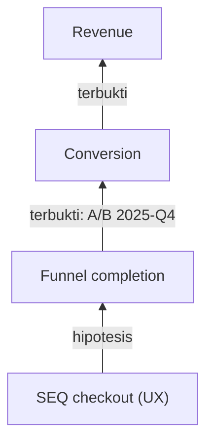

# Mode: connect — Map UX Metrics to Business Metrics

Build a metric tree that shows how UX metrics drive business metrics — as labeled hypotheses, never as claimed facts.

## Intake

- What business metric matters to the company/stakeholders right now (revenue, conversion, retention, cost-to-serve, NPS)? If the user doesn't know, help pick from the AARRR stage the product is fighting in.
- Which UX metrics to connect — from a prior `identify` run, or run a quick identify first.
- What evidence already exists for any link (A/B test, korelasi di data, studi)? This determines the evidence labels.

## Process

1. Place the business outcome at the top, product metrics in the middle, UX metrics as leaf drivers (see metric tree in `frameworks.md`).
2. Write every arrow as an explicit causal chain, e.g.: *SEQ checkout naik → task success checkout naik → funnel completion naik → conversion naik → revenue naik*. No skipped steps — the middle links are what stakeholders will challenge.
3. Label every arrow's evidence strength: **terbukti** (ada data/eksperimen — sebut sumbernya), **hipotesis** (masuk akal + ada indikasi), **asumsi** (belum ada bukti). An all-"asumsi" tree is still useful — it becomes the measurement agenda.
4. For each hypothesis/assumption arrow, state how it could be tested (correlation check on existing data, A/B test, cohort comparison) — this feeds mode `measure`.
5. Write a 3–5 sentence stakeholder narrative: plain language, business metric first, UX metric as the lever, no jargon (same register as `ux-voice` stakeholder tone).

## Output

Mermaid diagram + tables in chat/.md. Offer to render the tree as a FigJam board (load `figma-use` first, confirm before writing to the user's file).

````
# Metric Tree: [produk]



## Rantai hipotesis
| Panah | Klaim kausal | Bukti | Cara menguji |
|---|---|---|---|

## Narasi untuk stakeholder
[3–5 kalimat: mulai dari business metric, posisikan UX metric sebagai tuasnya.]

**Langkah berikutnya** — `/ux-metrics measure` untuk panah berlabel asumsi/hipotesis; `/ux-metrics okr` bila tree ini mau diturunkan jadi target tim.
````

## Scale

A tree wider than ~3 business metrics means the scope is a department strategy, not a design initiative — split per business metric, or take the prioritization to `ux-workshop converge`.
